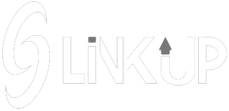

<div align="center">
  
</div>
<h1 align="center">Get Link Up with your friends anywhere and anytime 🔗</h1>
<p align="center">A MERN stack project that wants to be a social media when it grows up</p>
<br/>

<br/>

Welcome to the LinkUp! This is a MERN stack project that provides an attractive and seamless chatting experience. With its user-friendly interface and advanced features, this application allows users to engage in real-time conversations with others, keeping them connected and up to date.

<br>

## 🌟 Table of contents

- 📋 [Documentation](./docs)
- 🚀 [Features](#features)
- 📦 [Installation and Setup](#Installation-and-setup)
- 📝 [Contributing](./CONTRIBUTING.md)
- ⚖️ [License](./license)
- ✨ [Contributors](#contributors)
- 🤝 [Contact](#contact)

## 🚀 Features <a id="features"></a>

- 🔒 **Secure Authentication**: Enjoy a safe and secure login process with options for traditional credentials and seamless Google authentication.
- 🌈 **Aesthetic Interface**: Experience an attractive and visually pleasing chat interface that enhances your conversations and keeps you engaged.
- ✉️ **Real-Time Chat**: Engage in seamless and real-time conversations with your friends and stay connected anywhere, anytime.
- 💡 **Online Status and Last Seen**: Stay informed about the availability of your chat contacts with online status indicators and last seen timestamps.
- 💪 **Persistent User Data**: Your user data is securely stored and managed in a MongoDB database, ensuring seamless sign-in and personalized chat experiences.
- 📱 **Mobile-Responsive Design**: Access LinkUp on your mobile devices and enjoy a fully responsive design that adapts to different screen sizes. _(not yet actually)_
- 🎨 **Attractive UI Libraries**: Utilizes libraries like Bootstrap and framer-motion to create a modern and visually appealing user interface.
- 🤝 **Open-Source Project**: LinkUp is an open-source project, welcoming contributions from the community to enhance its features and functionality.

## 📦 Installation and setup <a id="Installation-and-setup"></a>

To run LinkUp locally on your machine, follow these steps:

1. Clone the repository from GitHub:

```bash
git clone https://github.com/your-username/linkup.git
```

2. Install the dependencies for the server:

```bash
cd linkup-backend
npm install
```

3. Install the dependencies for the client:

```bash
cd ../linkup-frontend
npm install
```

4. Set up the environment variables:

```
cp ./env_sample/.env.backend.sample ./linkup-backend/.env
cp ./env_sample/.env.frontend.sample ./linkup-frontend/.env
```

5. Start the development server:

- Run the server:

```bash
cd ../linkup-backent
npm start
```

- Run the client:

```bash
cd ../linkup-frontend
npm start
```

6. Access LinkUp in your web browser:

```bash
http://localhost:3000
```

### For automatic setup

run `setup.sh` in terminal
<br/><br>
